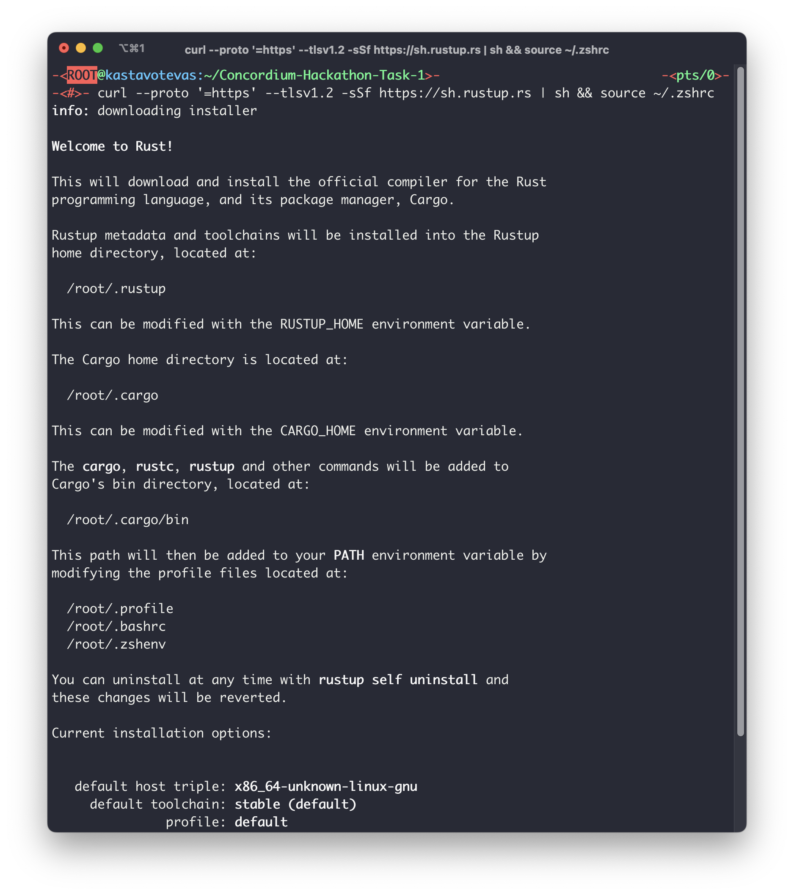
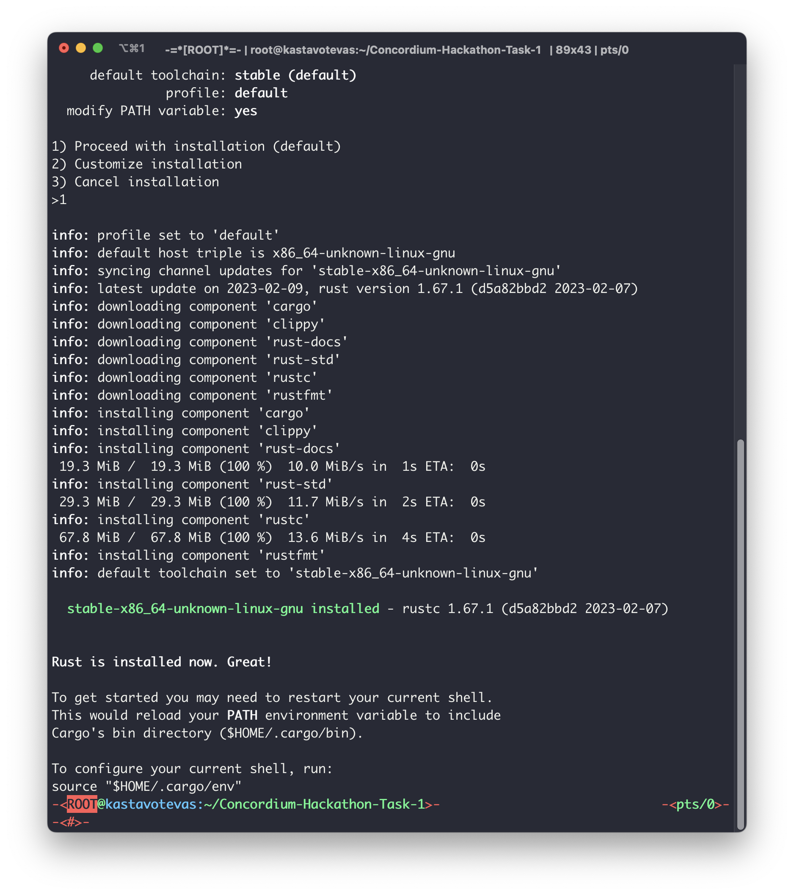
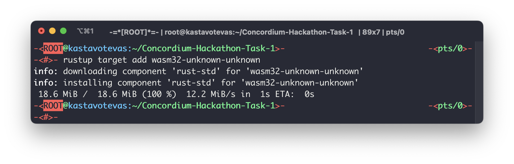
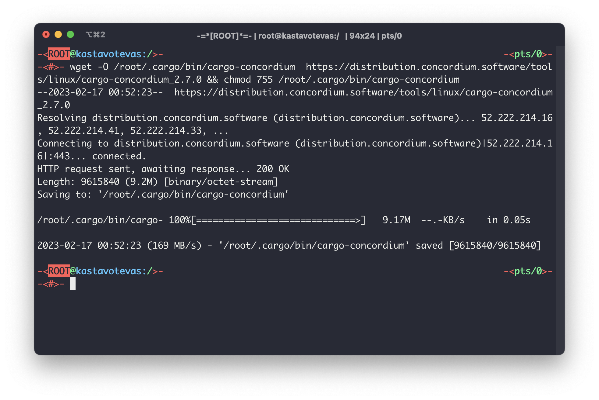
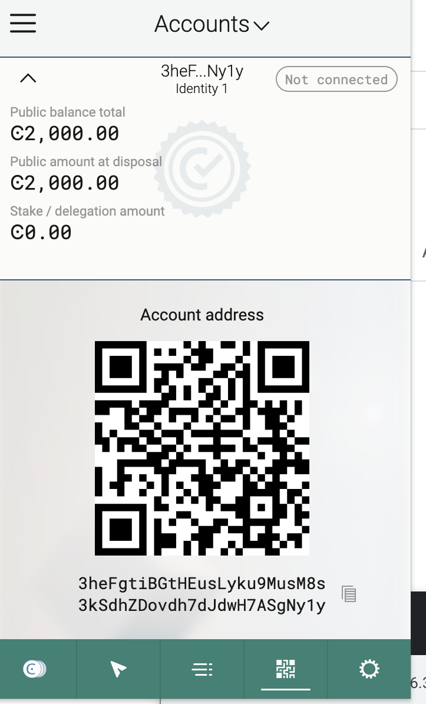
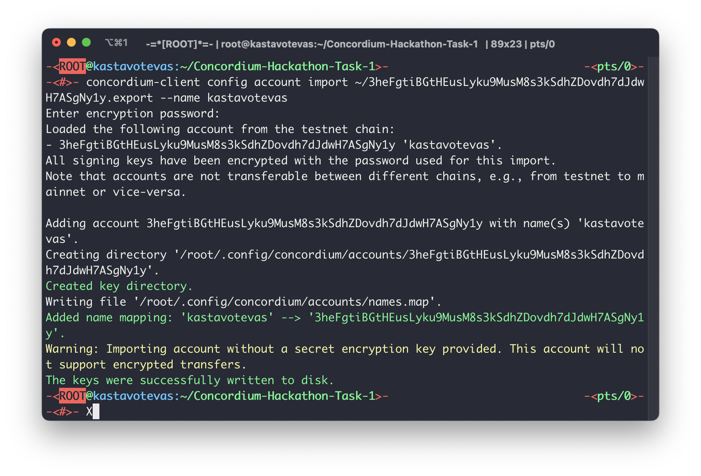

Concordium Hackathon Task 1 Submission

This is a submission for the Concordium Hackathon Task 1. The goal of this project is to help developers set up their environment to work with the Concordium blockchain.

To get started with Concordium, follow these simple s:

1. Install Rust

Rust is the programming language used to develop and deploy smart contracts on Concordium. Follow the instructions on the Rust website to install it.

2. Install cargo-concordium

Cargo-concordium is a command-line tool that lets you compile smart contracts, deploy them to the Concordium network, and manage accounts. To install cargo-concordium, follow the instructions provided.

3. Install Concordium-client

Concordium-client is a graphical user interface that allows you to manage your accounts, transactions, and smart contracts. To install Concordium-client, visit the Concordium Github repository and download the latest release.

4. Create a Testnet account

To create a Testnet account, follow the instructions on the Concordium documentation. You can also acquire testnet CCD by visiting the CCD faucet.

5. Export and import the account

To use your Testnet account with Concordium-client, you need to export it from the web wallet and import it into Concordium-client. Follow the instructions on the Concordium documentation to learn how to do this.

